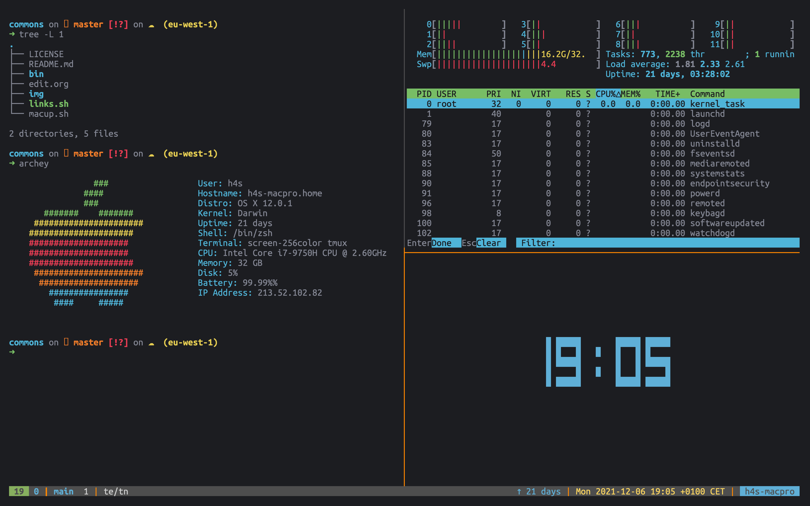

# An Old Hope (tmux)

This is a color theme for [tmux](https://github.com/tmux/tmux), based off the initial [Atom Theme by jesseleite](https://github.com/jesseleite/an-old-hope-syntax-atom).

Two themes are provided:

- an-old-hope.conf
- an-old-hope-black.conf

The only difference the the "black" variation is the background is true black.

## usage

These are to be added to .tmux.conf. They are opinionated about formatting of the line how I like it, but you are free to use the colors and change the format as you see fit.

    curl https://raw.githubusercontent.com/theherk/an-old-hope-tmux/main/an-old-hope.conf >> ~/.tmux.conf

Or, for the black variant:

    curl https://raw.githubusercontent.com/theherk/an-old-hope-tmux/main/an-old-hope.conf >> ~/.tmux.conf

## screenshots

